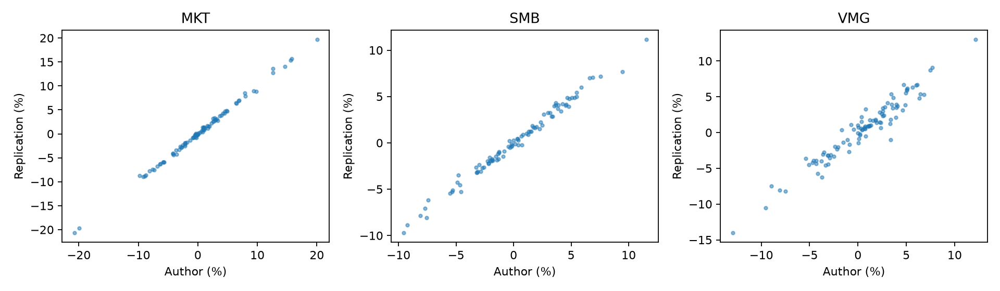
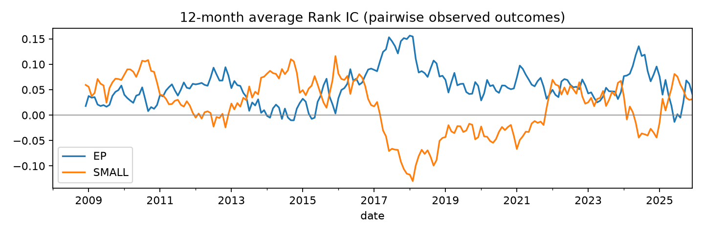
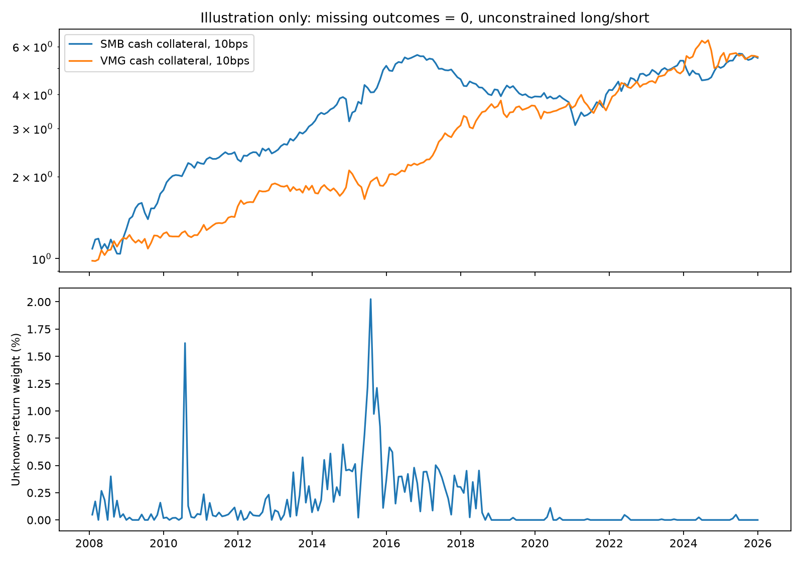

# CH-3 因子复现与研究方法学习手册

> 本地实证版本：2026-09-26。对象：希望从一次真实复现中理解数据清洗、因子构造、收益回测与有效性检验的学习者。
>
> **阅读时请始终分清：论文规定、我们的实现约定、数据不足时的演示假设。** 本文的数字来自本地 CSMAR 个股数据运行结果，不是合成数据，也不是复制作者因子后再声称独立构造。

## 1. 这次完成了什么，哪些结论还不能下

我们从股票月收益、历史股本、上市信息、扣非利润和公告日期出发，构造了 CH-3 的 MKT、SMB、VMG，保存了逐月股票池、分组持仓、六个组合收益、因子收益和数据核查日志，并进行了官方序列对照、Rank IC、均值与 alpha 检验、反转组合定价检验、成本演示和敏感性实验。

主区间为 **2008-01—2025-12，共 216 个日历月**：

- **2008—2016**：与论文 2000—2016 样本重叠的部分，不能冒充原论文完整 204 个月复现。
- **2017—2025**：论文样本结束后的延伸检验。它不是我们在 2016 年真实冻结策略后获得的前瞻样本；数据是现在下载的，不能称为完全干净的样本外实盘验证。
- 2007 年作为财务数据起始与准备期。缺少更早的常规利润输入，不能执行论文脚注的缺失扣非利润替代规则。
- 未混入股改补充表 EDR_G02：它缺少逐条可用日期，无法证明当年投资者已知这些回溯利润。

有一个真实的数据边界案例：初次检查尝试延伸到 2026 年 6 月，但 2026 年 2 月原始行情中的月交易天数最多为 14 天。机械执行“最近月不少于 15 天”的规则会使 2026 年 3 月没有组合。为避免把缺失整月压缩成连续收益，本报告使用最后一个完整年度作为终点；程序会检查日历完整性，不让整个空月份悄悄消失。这是覆盖边界的修正，不是根据收益优劣选择结束日期。

**本次输出分为两层：**

| 输出 | 缺失下月收益怎么处理 | 可以回答什么 |
|---|---|---|
| 严格复现 `factors_strict.csv` | 不改形成期持仓；受影响的组合和因子记为缺失 | 完整可观测月份是否与作者结果相符；原始数据究竟缺在哪里 |
| 零收益演示 `factors_zero_outcome_illustration.csv` | 形成期持仓完全相同，只假设未知下月收益为 0 | 演示完整月度计算、净值、成本与敏感性；不能证明真实可交易收益 |

| 因子 | 日历月数 | 有效收益月数 | 严格口径缺失月数 |
| --- | --- | --- | --- |
| MKT | 216 | 92 | 124 |
| SMB | 216 | 92 | 124 |
| VMG | 216 | 99 | 117 |

严格序列里 MKT/SMB 只有 92 个有效月份，VMG 有 99 个。因此我们**完成了现有数据的可追溯构造和有限条件下的检验，尚未得到无假设的连续 216 个月可交易回测**。缺失持仓、月份、权重都已输出，可据此逐个补齐数据。

学习时优先理解以下四个问题，而不是先看哪条净值最高：

1. 数字是不是当时已知？
2. 收益是不是来自预先确定的持仓？
3. 收益能否由已有暴露解释？
4. 加上现实交易约束后，还剩多少经济意义？

建议分三轮学习：先读第 2—6 节并复算一只股票；再读第 7—12 节解释各项检验；最后读第 13—16 节重跑成本与敏感性实验。每轮都先核对输入和时点，再看收益数字。

## 2. CH-3 到底是什么：信号、组合、因子和模型

这四个对象不能混为一谈。

**信号**是每只股票在某个时点的一个数。例如：

$$
EP_{i,t}=\frac{E_{i,t}^{\text{latest available}}}{P_{i,t}\times Shares^{all}_{i,t}}.
$$

它是横截面特征。高 EP 代表相对于价格有较高盈利，通常被称为价值端；负 EP 不能解释成“越负越便宜”。

**组合**是根据当时可知信号确定的持仓权重。例如，大盘且高 EP 的股票组成 BV 组合。

**因子收益**是几个组合收益的固定线性组合。例如 VMG 是价值组合减成长组合，它本身是一条随时间变化的收益序列。

**因子模型**是收益与因子之间的统计关系：

$$
R_{i,t}-R_{f,t}=\alpha_i+\beta_{M,i}MKT_t+\beta_{S,i}SMB_t+\beta_{V,i}VMG_t+\epsilon_{i,t}.
$$

这里的 beta 是收益的时间序列暴露，并不等于股票的规模或 EP 特征。按规模双排序可以减轻组合构成差异，却不保证 SMB 与 VMG 零相关，也不保证市场 beta 为零。

因此，“发现新信号”不等于“发现新定价因子”，更不等于“获得可交易策略”。下面的检验流程正是用来逐步区分这些结论。

## 3. 研究框架：保留原始数据，把判断写进规则

```text
原始文件（只读）
  ├─ 月收益、价格、交易天数
  ├─ 历史股本、上市事件
  └─ 财报数值、实际公告日、无风险利率
            ↓ 字段映射、单位换算、主键与缺失审计
标准面板（保留来源和日期）
            ↓ 按公告日 / 股本生效日向后匹配
每个月末当时可知的股票截面
            ↓ 样本筛选、独立分组、固定权重
六组合与下月收益
            ↓ 严格结果 / 明示假设的演示结果分开
官方对照、IC、均值、alpha、GRS、成本、敏感性
            ↓
结论 + 局限 + 可追溯文件
```

本次执行入口是 [reproduce_ch3_csmar.py](../scripts/reproduce_ch3_csmar.py)。它复用已有 CH-3 引擎，没有为迎合作者收益而重新拟合一组权重。

| 层次 | 具体职责 | 为什么单独保留 |
|---|---|---|
| 原始层 | `private_data/csmar_raw` 中的原始 CSV/XLSX、说明文件 | 后续任何处理都能返回原始记录检查 |
| 适配层 | `prepare()` | CSMAR 字段名不应渗透进所有下游分析 |
| 时点层 | `PointInTimePanel` 与 `merge_asof` | 防止报告期、公告日、形成日混用 |
| 构造层 | `build_ch3_factors()` | 把分组规则与统计检验分离 |
| 分析层 | `analyze()` | 同一组因子用多个角度评价，不能只挑一个漂亮指标 |
| 证据层 | 配置、文件哈希、逐股日志、测试结果 | 结果异常时可以定位到具体数据和规则 |

不要覆盖旧原始文件、不要把所有缺失一律补零、不要只保留最终净值。一个无法解释股票为什么进入组合的回测，很难称为可靠研究。

## 4. 数据清洗：先确定“每行是什么”，再开始计算

### 4.1 实际使用的字段

| 表 | 本次使用的主要字段 | 主键 / 时间 |
|---|---|---|
| TRD_Mnth | `Stkcd, Trdmnt, Mclsprc, Msmvttl, Mretwd, Ndaytrd, Markettype` | 股票 × 月份 |
| TRD_Capchg | `Nshrttl, Nshrb, Nshrh, Nshroft, Nshrprf` | 股票 × 股本变动日 `Shrchgdt` |
| CG_Co | `ListedDate, DelistedDate` | 股票 × 上市事件，不强行要求代码唯一 |
| FI_T2 | 扣非归母利润 `F020102` | 股票 × 报告期 `Accper` |
| IAR_Forecdt | 实际披露日 `Actudt` | 股票 × 报告期 |
| TRD_Nrrate | 一年期存款利率 `Nrrdata`，基准 `NRI01` | 日历日期 |

先用字符串读取证券代码，避免 `000001` 变成 `1`。XLSX 中有中文表头、单位说明行时，只保留六位数字代码的观测行，但不随意删除真实负数利润或极端收益。

### 4.2 单位是第一道检查

- 月收益 `Mretwd` 按原数据小数使用，例如 `0.05` 代表 5%，不能再除以 100。
- `Msmvttl` 的单位是千元，用作市值比较时乘以 1,000。
- 历史股本字段按股数使用；扣非利润按元使用。
- `Nrrdata` 是年利率百分数，`1.5` 代表年化 1.5%，不能直接当月收益。

同一家公司同一时点的“利润÷市值”必须使用一致金额单位。若利润是元、市值是千元而忘记转换，EP 会扩大 1,000 倍。虽然统一倍数未必改变排序，却会使所有经济解释、跨源比较和阈值失效。

### 4.3 两种市值为什么要分开

规模排序与组合权重需要：

$$
ME^{A}_{i,t}=P_{i,t}\times Shares^{A}_{i,t}.
$$

EP 分母需要：

$$
ME^{all}_{i,t}=P_{i,t}\times Shares^{all}_{i,t}.
$$

公司利润属于整个公司，不能只用 A 股那部分股数作分母；同时，论文组合权重又明确按全部 A 股市值，包括非流通 A 股。

当前股本导出没有直接给出完整的“总 A 股合计”字段。基准使用如下**近似重建**：

$$
Shares^{A,proxy}=Nshrttl-Nshrb-Nshrh-Nshroft-Nshrprf.
$$

这一步依赖股本分类的完整性，以及总股数与这些分项之间的口径一致性。不能因为公式看似自然，就宣称所有历史记录精确等价于 WIND 的 `S_SHARE_TOTALA`。程序保留了替代口径实验：用 `Msmvttl×1000` 作为规模和权重市值，EP 分母仍保持不变。

核查时，重建全股本市值与行情市值不一致未必是错误：A+B 或 A+H 公司本来就可能存在差异。应先检查比较的是同一种市值，再追查股本事件时点。当前准备窗口（2006-12—2026-06）的核查中，A 股代理市值与行情市值相差超过 1% 的记录有 1,242 条；这是需要继续核对的记录，不是自动删除理由。

### 4.4 上市事件与股本事件：为什么不能直接取最新一行

CG_Co 中 `600018` 有两段上市记录：2000 年与 2006 年。直接按代码保留最后一行，会把较新的上市日期错误应用到早期历史。

本次按形成日向后匹配最近一次已经发生的上市事件。股本同样按 `Shrchgdt` 匹配，不从未来倒填：

```python
pd.merge_asof(
    stock_months.sort_values("date"),
    share_events.sort_values("Shrchgdt"),
    left_on="date", right_on="Shrchgdt",
    by="Stkcd", direction="backward",
)
```

如果 2 月 10 日股本从 100 股变成 200 股，1 月末只能用旧值。即使 200 股是今天下载到的最新值，也不能用它计算 1 月市值。

### 4.5 交易天数必须沿日历滚动

论文要求最近 12 个月至少 120 个交易记录日、最近月至少 15 个交易日。

错误写法是直接对每只股票现有的 12 行求和：如果股票停牌三个月，12 行可能跨越 15 个日历月。

本次先建立完整月历，对“没有行情行”的月份仅在**交易天数计数中**填 0，再做 12 个月滚动求和。这里填的是交易日数，不是收益。两者不能混淆。

### 4.6 缺失财务信息的处理

本次清洗审计结果：

| 检查项 | 记录数 | 处理 |
| --- | --- | --- |
| 原始月行情行数 | 902,613 | 保留原始文件 |
| 主分析所需市场面板（含形成准备月） | 666,393 | 2007-12—2025-12 |
| 筛定代码与报告期内财报行数 | 234,382 | 与实际公告表一对一匹配 |
| 缺失/异常公告日 | 190 | 保留问题清单，不进入时点面板 |
| 利润缺失 | 445 | 保留缺失，不作普通利润替代 |
| 有效公告日的财报行数 | 234,192 | 不代表每行利润均非空 |
| 准备窗口中无历史股本匹配的行数 | 50 | 不以未来股本倒填 |

没有可核验的公告日，就不允许进入时点面板；最新财报利润缺失时，仍保留这条缺失报告，不让旧的非缺失利润悄悄继续充当“最新利润”。

作者附录允许扣非利润缺失时使用“不含少数股东损益的净利润”。这条规则应当执行，但我们当前没有该替代利润列，因此本次仍排除无法构造 EP 的股票。**规则允许替代，不代表可以虚构替代数值。**

这些缺失可能改变股票池和因子均值，所以它们属于研究结果的一部分，不只是工程噪声。

## 5. 时点对齐：最重要的防错思想

### 5.1 至少有四个日期

| 日期 | 含义 | 本次用途 |
|---|---|---|
| 报告期末 | 财报描述哪段经营活动 | 标识财报，不代表已公开 |
| 公告日 | 财报何时向公众披露 | 信号可用的起点 |
| 形成月末 | 何时排序、确定权重 | 只能使用此前可用信息 |
| 收益实现月 | 哪个月的涨跌计入因子 | 严格为形成月的下一个月 |

例：2020 年年报在 2021-04-20 发布。2021 年 3 月末不能使用它；4 月末可以用于形成组合，对应的因子收益应标记为 **2021 年 5 月**。

```python
# 示意：实际函数还处理同日多期财报及来源字段
latest = pd.merge_asof(
    requests.sort_values("formation_date"),
    reports.sort_values("available_at"),
    left_on="formation_date", right_on="available_at",
    by="security_id", direction="backward",
)
```

绝不能用“报告期小于形成日”代替“公告日小于形成日”，也不应把所有公司统一设为次年 4 月或 7 月，而忽略已经拥有的实际披露日。

### 5.2 最近公开财报并不自动等于 TTM

基准直接使用 `F020102` 的已报告值，没有擅自转换为 TTM，也没有把累计中报减去年报来造单季利润。累计值、单季值和 TTM 是不同变量。

例如中报利润与一季报利润通常覆盖不同长度的经营期间。若不同公司披露进度不一致，使用“最近报告值”会带来排序差异。这里遵循论文措辞的字面实现，同时将口径未完全验证作为限制。不能先试十种口径，再把相关性最高的一种写成作者原方法。

### 5.3 公告日对齐仍不等于彻底没有前视偏差

当前 FI_T2 没有历史修订版本字段。假如今天下载的 2010 年利润已经被 2013 年重述，再连接 2010 年原公告日，代码日期会通过检查，但数值仍可能含未来信息。

本次只能保证：**程序没有读取公告日在形成日之后的行；不能保证数据商当前数值就是当年最初披露值。**

此外，我们在日历月末使用此前公告，但组合价格为月末收盘价。若公告发生在最后交易日收盘后，下一交易日执行价未必等于该收盘价。月度数据无法准确刻画这种执行误差。公告额外延后 30 天的实验用来观察时点敏感性，不能代替历史版本数据，也不是精确的盘后公告解决方案。

### 5.4 用一只股票把日期串起来

下面是 `000001` 的实际记录节选。它用于学习流程，不是挑选最好看的股票：

| 形成月末 | 使用财报期末 | 公告日 | 已报告利润（元） | EP | 收益月份 |
| --- | --- | --- | --- | --- | --- |
| 2007-12-31 | 2007-09-30 | 2007-10-23 | 1,867,054,000 | 0.02109 | 2008-01 |
| 2008-01-31 | 2007-09-30 | 2007-10-23 | 1,867,054,000 | 0.02445 | 2008-02 |
| 2008-02-29 | 2007-09-30 | 2007-10-23 | 1,867,054,000 | 0.02456 | 2008-03 |
| 2008-03-31 | 2007-12-31 | 2008-03-20 | 2,607,545,000 | 0.04032 | 2008-04 |

完整轨迹见 `private_outputs/ch3_csmar_20260926/trace_000001.csv`（需在本地运行后查看，不随仓库分发）。试着逐行回答：哪份财报被使用？何时公开？股票为何被保留或排除？这一行实际贡献的是哪个月的收益？

## 6. 从股票截面构造六个组合

每个月末重复相同流程，断点只用当月截面计算：

1. 保留沪深主板及创业板 A 股；本次市场代码为 1、4、16，不引入后续新增板块。
2. 排除无有效市值、上市不足 6 个月、交易记录不足及无有效 EP 的股票。
3. 不额外排除 ST 和金融股；否则是在改动样本。
4. 按 A 股市值代理从小到大排序，剔除最小 `floor(0.3×N)` 只。
5. 剩余样本按规模分成 S/B，各约一半。
6. 在同一剩余股票池内独立按 EP 分成 G/N/V，约为 30%/40%/30%。
7. 两种分组取交集，形成 SG、SN、SV、BG、BN、BV。负 EP 股票归入 G。

注意第 6 步是**独立排序**：不是在 S、B 内分别重新计算 EP 分位点。本文用 N 表示中间组，避免与市场因子 MKT 混淆；论文常用 M 表示中间组。

若负 EP 股票超过 30%，强制归入 G 后，G 比例可以超过 30%。同值排序用证券代码作稳定的次级排序键，避免结果随输入文件行序变化。原文没有规定的断点边界与筛选先后次序，均属于本次明确记录的实现约定。

例如有 1,000 只通过基本筛选的股票：先剔除 300 只，剩余 700 只。规模分组约 350/350，EP 分组约 210/280/210。由于规模与价值特征可能相关，六个交叉组合人数不必相等。

组合收益为：

$$
w_{i,t}^{p}=\frac{ME^A_{i,t}}{\sum_{j\in p_t}ME^A_{j,t}},\qquad
R_{p,t+1}=\sum_{i\in p_t}w_{i,t}^{p}R_{i,t+1}.
$$

所有权重都用形成期市值。用下月末市值加权，会让已经上涨的股票获得更高权重，污染因果顺序。

三个因子为：

$$
SMB=\frac{SV+SN+SG}{3}-\frac{BV+BN+BG}{3},
$$

$$
VMG=\frac{SV+BV}{2}-\frac{SG+BG}{2},
$$

$$
MKT=R_{\text{保留股票池，市值加权}}-R_f.
$$

SMB 与 VMG 已经是多空收益差，**不再额外减一次无风险收益**。

本次所有有组合的月份均通过“六组合各不少于 50 只”的宽度诊断。但人数多不代表单一大市值股票不会占很高权重；后续可补充最大权重及集中度检查。

## 7. 缺失收益为什么会决定结论

形成期之后，部分持仓在下月没有可用行情行。本次有 **812 条持仓下月收益缺失**，占 437,893 条持仓记录的一小部分，但会影响很多月份。

| 指标 | 结果 |
| --- | --- |
| 缺失来自下月无行情行 | 812 |
| 下月有行情行但收益为空 | 0 |
| 市场组合中未知收益权重的月均值 | 0.144% |
| 市场组合中未知收益权重的最大值 | 2.025% |

“没有股票月记录”不等于已经证明“收益为零”，可能涉及停牌、合并、终止上市或数据覆盖问题。严格序列中，只要某组合的一只股票缺失收益，该组合当月就无法完整计算；SMB/VMG 也按其所依赖组合传播缺失。

尤其不要这样做：

```python
# 错误示例：看到了未来收益缺失才把股票从形成期股票池删除
stocks = stocks.dropna(subset=["next_month_return"])
weights = stocks["me"] / stocks["me"].sum()
```

它不仅改变收益，还会改变规模断点、EP 分组以及所有其他股票的权重。现实中的投资者在形成时并不知道未来数据文件会缺哪几行。

本次零收益演示保持所有形成持仓不变，只在收益结算时令缺失值为 0。这同样是强假设：若股票继续停牌，我们还默认下次月末能按规则退出或调整它，而实际未必能成交。因此它不能称为“处理完停牌后的真实策略”。

为了量化这项假设，额外计算了情景压力：每条未知收益都在假设的 ±30% 幅度内，按对相应多空持仓最不利或最有利的方向赋值。此区间**不是统计置信区间，也不保证覆盖真实停牌或退市损益**。

| 因子 | 不利情景月均收益 | 零收益假设月均收益 | 有利情景月均收益 |
| --- | --- | --- | --- |
| SMB | 0.625% | 0.753% | 0.881% |
| VMG | 0.642% | 0.768% | 0.894% |

更严格的后续工作是取得日收益、停复牌状态、分红和退市处置数据，逐股维护不能交易的冻结持仓，记录恢复交易后的现金与股份变化。当前月频文件不足以完成这些步骤。

## 8. 先判断“复现一致性”，再判断“因子有效性”

两者不是一个问题。即使精确复制了一个长期亏损因子，也可以是成功复现；即使新曲线赚钱，若与目标方法无关，也不是成功复现。

与作者公开月度序列按**收益实现月**对齐，只比较双方都有数据的日期：

| 口径 | 因子 | 共同月份 | 相关系数 | 平均差（bp/月） | RMSE（bp/月） |
| --- | --- | --- | --- | --- | --- |
| 严格：完整月份 | MKT | 92 | 0.9989 | 1.45 | 30.96 |
| 严格：完整月份 | SMB | 92 | 0.9946 | -3.36 | 44.24 |
| 严格：完整月份 | VMG | 99 | 0.9665 | -4.46 | 109.37 |
| 缺失收益置零演示 | MKT | 216 | 0.9993 | 0.27 | 26.30 |
| 缺失收益置零演示 | SMB | 216 | 0.9931 | 1.46 | 49.74 |
| 缺失收益置零演示 | VMG | 216 | 0.9623 | -0.49 | 107.84 |

这里：

- 相关系数衡量共同波动，不能识别恒定偏差。
- 平均差以 bp 表示，1 bp = 0.01 个百分点。
- RMSE 衡量逐月误差大小，能发现“相关性很高但偏差仍有经济意义”的情况。
- 严格口径的比较月份有限，且可能是选择性样本。
- 演示口径的高相关性不能反过来证明所有缺失收益真为零。



三条因子中，VMG 的逐月误差更明显。合理排查顺序是：利润数值和报告期口径 → 公告版本 → A 股/全股本市值 → 排序断点 → 筛选顺序 → 无风险利率。不要上来就尝试优化权重以提高相关系数。

本次无风险收益采用每天的一年期存款年化报价，按 ACT/365 复利累计至月度：

$$
R_{f,m}=\prod_{d\in m}(1+y_d/100)^{1/365}-1.
$$

这是本次明确的日历计息约定，不声称精确等同于作者所有日期的利率处理。与作者 RF 的平均绝对差为 0.559 bp/月。对照计算不会用作者 RF 覆盖本地利率，因此 MKT 的利率部分也独立构造。

## 9. 第一层有效性：信号是否有预测排序能力

### 9.1 Rank IC

每个形成月，计算信号与下月收益的 Spearman 相关系数：

$$
IC_t=Corr_{rank}(EP_{i,t},R_{i,t+1}).
$$

规模信号用 `-log(ME)`，这样正 IC 表示“小股票下月相对表现好”。当月 EP 的横截面排序不会使用未来收益；IC 统计本身只能在事后对有观测结果的股票成对计算，必须同时记录样本数。

| 信号 | 月份 | 平均 Rank IC | 月度 ICIR | HAC t | p 值 | IC 为正月份比例 |
| --- | --- | --- | --- | --- | --- | --- |
| EP | 216 | 0.0546 | 0.369 | 6.27 | 3.55e-10 | 65.7% |
| SMALL | 216 | 0.0183 | 0.116 | 1.72 | 0.0856 | 54.6% |

EP 的平均 Rank IC 为约 0.055，不能解读为“每月赚 5.5%”。IC 是无量纲相关系数。它说明在当前保留股票池和可观测结果中，高 EP 倾向于获得更高的相对收益；不直接说明多空组合能赚多少，也不保证独立于行业、规模或其他因子。

ICIR 在本报告定义为月度 `mean(IC)/std(IC)`，未乘 `sqrt(12)`。不要把它与收益夏普比率混用。



### 9.2 十分组与单调性

按 EP 分十分组，用形成期市值加权看下月收益。为了不让各组因缺失收益采用不同月份，下面只使用十组都完整的共同月份：

| EP 组（低→高） | 共同完整月份 | 市值加权月均收益 |
| --- | --- | --- |
| 1 | 92 | 0.593% |
| 2 | 92 | 0.221% |
| 3 | 92 | 0.502% |
| 4 | 92 | 0.524% |
| 5 | 92 | 0.451% |
| 6 | 92 | 0.749% |
| 7 | 92 | 0.724% |
| 8 | 92 | 0.446% |
| 9 | 92 | 0.515% |
| 10 | 92 | 0.913% |

应观察总体梯度、两端差与中间组，而不是要求十个数字严格递增。低 EP/负 EP、行业差异及噪声都可能造成局部不单调。此处仍是在 CH-3 保留股票池内的诊断，不是对全体 A 股的普适结论。

## 10. 第二层有效性：平均溢价是否稳定、显著

### 10.1 经济量级与统计显著性分开看

月均收益为 $\bar f$，传统 t 值为：

$$
t=\frac{\bar f}{s_f/\sqrt{T}}.
$$

月收益可能存在异方差和自相关，所以主表使用 Newey–West HAC 标准误，固定滞后 4 个日历月、Bartlett 权重，不作小样本修正；p 值和区间使用渐近正态分布。0、6、12 阶作为敏感性，不选择最显著的一档。

| 口径 | 因子 | 有效月份 | 月均收益 | HAC t | 95% 均值区间（月） |
| --- | --- | --- | --- | --- | --- |
| 严格：完整月份 | MKT | 92 | 0.417% | 0.55 | [-1.074%, 1.908%] |
| 严格：完整月份 | SMB | 92 | 0.193% | 0.47 | [-0.611%, 0.997%] |
| 严格：完整月份 | VMG | 99 | 0.554% | 1.58 | [-0.131%, 1.239%] |
| 缺失收益置零演示 | MKT | 216 | 0.159% | 0.32 | [-0.832%, 1.150%] |
| 缺失收益置零演示 | SMB | 216 | 0.753% | 2.60 | [0.185%, 1.321%] |
| 缺失收益置零演示 | VMG | 216 | 0.768% | 3.42 | [0.327%, 1.209%] |

**严格口径与零收益演示的均值差异，不能全归因于那几只股票收益被置零。** 更大的原因可能是严格均值只用了完整月份，而演示均值用了全部 216 个月。这是不同日期样本的比较。相同完整月份上的两种构造完全一致。

HAC 只能改进某些标准误估计，不能修复错误财报、未来信息、幸存者偏差或不可交易持仓。严格序列存在非随机缺失月份，其显著性仍需谨慎解释。明细表中严格口径的年化波动和夏普也是对保留月观测的描述，不能当作连续账户的实际风险收益指标。

### 10.2 日历空洞的技术细节

若 1 月与 3 月有收益，2 月缺失，先 `dropna()` 再直接算滞后 1 会错误地把 1 月与 3 月视为相邻月。

本次 OLS 用可观测日期拟合，但 HAC 用完整日历上的 score：

$$
u_t=x_t\hat\epsilon_t,\quad
S=\sum_tu_tu_t'+\sum_{l=1}^L\left(1-\frac{l}{L+1}\right)\sum_t(u_tu_{t-l}'+u_{t-l}u_t').
$$

$$
\widehat{Var}(\hat\beta)=(X'X)^{-1}S(X'X)^{-1}.
$$

缺失月份的 score 填 0，仅用于保留滞后的日历距离；**没有向回归添加收益为零的假观测**。这仍不能解决缺失月份的选择偏差。

### 10.3 子区间比总样本更能暴露不稳定性

下表全部为零收益演示，以保持日期连续和可比，结论以该假设为条件：

| 时期 | 因子 | 月均收益 | HAC t |
| --- | --- | --- | --- |
| 2008—2016 | MKT | -0.071% | -0.08 |
| 2008—2016 | SMB | 1.539% | 3.79 |
| 2008—2016 | VMG | 0.684% | 2.50 |
| 2017—2025 | MKT | 0.390% | 0.94 |
| 2017—2025 | SMB | -0.033% | -0.10 |
| 2017—2025 | VMG | 0.852% | 2.40 |

SMB 在 2008—2016 年明显更强，2017—2025 年均值接近零；不能用较早时期拉高后的全样本均值推断未来。VMG 的两个时期都为正，但这仍不是未来收益承诺。

当你探索了很多信号、分位点和窗口，应记录完整试验集合，考虑多重检验或保留独立评估期。本文只有少量明确解释的规格，不把 p<0.05 当作自动通关标准。

## 11. 第三层有效性：是否包含已有因子之外的信息

例如检验 VMG 是否只是市场和规模暴露：

$$
VMG_t=\alpha+\beta_M MKT_t+\beta_S SMB_t+\epsilon_t.
$$

这叫 spanning / 增量解释检验。它不同于在构造前把信号对所有已知因子全部中性化。

| 被解释因子 | 控制因子 | 共同月份 | 月 alpha | HAC t | p 值 |
| --- | --- | --- | --- | --- | --- |
| SMB | MKT + VMG | 92 | 0.355% | 0.92 | 0.3558 |
| VMG | MKT + SMB | 92 | 0.676% | 2.11 | 0.0350 |

alpha 衡量在该模型下未被解释的平均收益，不等于“无风险套利”。模型遗漏、样本选择、交易成本和数据误差都能留下 alpha。这里使用严格因子共同完整的日期，因此结论只适用于这段可观测子样本。

若 alpha 不显著，也不能直接证明因子没有价值：它可能仍改善风险刻画、分散化或特定资产定价。反过来，alpha 显著也不自动证明存在新的经济机制。

## 12. 第四层有效性：CH-3 能否解释其他组合

### 12.1 为什么不能只回归自己的六个构造组合

SMB、VMG 就是六个组合的线性组合。用这些组合证明因子好，会有机械关联。尤其对完整构造组合机械套用 GRS，残差可能线性依赖，协方差矩阵奇异；不能用伪逆把报错藏起来。

本次另按形成月已经发生的当月收益，把同一合格股票池分成五个反转测试组合 REV1—REV5，REV1 是过去收益最低组，REV5 最高组。它们不是直接用 EP 六组合公式生成的，但仍与因子共用股票，因此也不是完全独立的外部资产测试。

分别回归：

$$
R_{p,t}-R_{f,t}=\alpha_p+\beta_{M,p}MKT_t+\epsilon_{p,t}
$$

以及 CH-3。比较时，两个模型和五个资产统一使用共同完整月份，不让样本差异冒充模型进步。

| 模型 | 共同月份 | 平均 R² | 平均调整后 R² | 平均绝对月 alpha |
| --- | --- | --- | --- | --- |
| CAPM | 92 | 0.8887 | 0.8874 | 0.252% |
| CH3 | 92 | 0.8965 | 0.8930 | 0.210% |

R² 衡量波动解释力，alpha 衡量平均收益解释。增加解释变量不会降低样本内普通 R²，所以还要看调整后 R²、alpha 及额外参数的意义。R² 高，并不意味着能事前预测收益方向。

### 12.2 GRS 联合检验

检验原假设为五个组合的 alpha 同时为零：

$$
H_0:\alpha_1=\cdots=\alpha_5=0.
$$

本次采用传统 GRS，代码使用残差协方差与因子协方差的最大似然除数 T：

$$
GRS=\frac{T-N-K}{N}
\frac{\hat\alpha'\hat\Sigma^{-1}\hat\alpha}
{1+\bar f'\hat\Omega^{-1}\bar f}.
$$

| 模型 | 资产数 | 共同月份 | GRS F | p 值 |
| --- | --- | --- | --- | --- |
| CAPM | 5 | 92 | 1.704 | 0.1422 |
| CH3 | 5 | 92 | 1.596 | 0.1702 |

其精确 F 参考分布依赖经典的独立同分布、正态残差等条件；这不是 HAC 稳健的联合检验。本次还存在完整月份选择和较小测试资产集合，因此它是教学性诊断。

p 值大表示“当前证据不足以拒绝所有 alpha 为零”，**不表示模型被证明正确**，更不能简单比较两个 p 值大小来宣布谁获胜。逐个 alpha 的 HAC 检验与 GRS 采用的协方差和假设不同，结果可能不一致。

每个资产的具体 alpha、t 值、beta 和 R² 都保留在 [pricing_regressions.csv](../results/20260926/pricing_regressions.csv)。看见某个组合显著，应同时检查五次检验的多重比较，而不只引用其中一项。

## 13. 回测：先定义资金，再谈净值和成本

### 13.1 因子收益差没有天然唯一的“本金收益率”

SMB 和 VMG 的多头权重合计 +1、空头合计 −1，净投资为 0、总敞口为 2。不能不说明本金和杠杆就宣称某个年化收益。

本次净值演示明确采用：**初始净资产 1，现金抵押 1，多头名义本金 1，空头名义本金 1**，每月恢复目标敞口。假设现金可按本次无风险利率计息、股票总收益能准确作用于多空头寸。

于是零成本的总资本收益为：

$$
R^{capital}_t=R_{f,t}+F_t.
$$

$$
NAV_t=\prod_{s\le t}(1+R^{capital}_s),\qquad
CAGR=NAV_T^{12/T}-1.
$$

算术年化均值 `12×月均收益` 不等于 CAGR。波动会让复利增长低于同均值的平滑增长。最大回撤是相对历史净值高点的最大跌幅，需要把初始净值 1 也视为可能的历史高点。

### 13.2 换手不能只比较两个月的目标权重

上月目标权重先随持仓收益漂移，再与本月目标比较：

$$
\widetilde w_{i,t}=
\frac{w_{i,t-1}(1+r_{i,t})}
{1+\sum_jw_{j,t-1}r_{j,t}+(1-\sum_jw_{j,t-1})R_{f,t}},
$$

$$
TradedNotional_{t+1}=\sum_i|w_{i,t}^{target}-\widetilde w_{i,t}|.
$$

本文的换手是买卖成交名义金额之和，不除以 2；若你使用“单边换手”定义，必须同步改变费用公式。首期建仓也计入成本，初始总成交敞口为 2。

### 13.3 成本情景

- 每单位成交收取 10 bp：`成本 = 0.001 × traded_notional`。
- 每单位成交 30 bp，另按空头名义本金收取每年 3% 借券费：`0.003 × traded_notional + 0.03/12`。

这里的费率是教学情景，不是对当前券商报价或实际历史税费的估计；没有精确建模冲击成本、涨跌停、融券可得性、保证金调整、强平和现金利差。费用使用零成本头寸漂移估计成交额，是成本的一阶近似；未按每种费率重建受费用影响的账户状态。没有强制在期末平仓，因此终值是盯市净值，不含最后一次平仓费。

**下表全部依赖“缺失个股收益为零、所有月末调仓可实现”的演示假设。不可当作实盘策略收益。**

| 因子 | 演示成本情景 | 资本 CAGR | 最大回撤 | 期末净值（初始 1） |
| --- | --- | --- | --- | --- |
| SMB | 零成本，含现金利息 | 10.55% | -43.46% | 6.082 |
| SMB | 每单位成交 10 bp | 9.88% | -44.72% | 5.448 |
| SMB | 30 bp + 年借券费 3% | 5.35% | -53.58% | 2.554 |
| VMG | 零成本，含现金利息 | 10.85% | -21.12% | 6.389 |
| VMG | 每单位成交 10 bp | 9.93% | -21.55% | 5.498 |
| VMG | 30 bp + 年借券费 3% | 4.93% | -23.43% | 2.377 |



图的上半部分展示两条演示净值；下半部分显示当月未知收益持仓在市场组合中的权重。这种画法迫使读者同时看到表现与数据缺口，而不是让漂亮曲线掩盖无法定价的资产。

本次 SMB、VMG 的平均月成交名义额约为净资产的 51.5% 和 69.9%。即使均值有统计显著性，换手、借券与回撤仍会显著改变持有体验和可实现回报。

## 14. 敏感性分析：改变一个假设，观察机制

下面实验均保留零收益演示假设，目的在于看构造规则的影响，不作为多次调参择优：

| 规格 | 因子 | 月均收益 | HAC t | 与基准相关性 |
| --- | --- | --- | --- | --- |
| 基准零收益演示 | SMB | 0.753% | 2.60 | 1.0000 |
| 基准零收益演示 | VMG | 0.768% | 3.42 | 1.0000 |
| 不剔除微盘 | SMB | 1.237% | 4.17 | 0.9730 |
| 不剔除微盘 | VMG | 0.570% | 2.72 | 0.9623 |
| 公告延后 30 天 | SMB | 0.704% | 2.43 | 0.9980 |
| 公告延后 30 天 | VMG | 0.634% | 2.88 | 0.9868 |
| 使用行情总市值作权重 | SMB | 0.752% | 2.60 | 0.9999 |
| 使用行情总市值作权重 | VMG | 0.768% | 3.43 | 0.9997 |

- **不剔除最小 30%**：观察小盘收益及价值收益是否明显改变。结果与“样本选择会影响溢价”的思想一致，但这一个实验不能单独证明壳价值的因果机制。
- **公告额外延后 30 天**：观察信号价值是否依赖最新财报进入组合的时间。它不能消除历史财报重述带来的潜在前视问题。
- **行情市值替代 A 股市值代理**：只改变规模与权重，不改变 EP 的全股本分母，避免一次改动多个逻辑。

HAC 滞后敏感性：

| 因子 | 0 阶 t | 4 阶 t | 6 阶 t | 12 阶 t |
| --- | --- | --- | --- | --- |
| MKT | 0.34 | 0.32 | 0.30 | 0.31 |
| SMB | 2.65 | 2.60 | 2.57 | 2.38 |
| VMG | 2.85 | 3.42 | 3.72 | 3.90 |

不要根据哪一列 t 最大就选择那一列作为主结果。主规格与对照都应保留。真正值得注意的是结论是否随着合理的小改动就翻转，以及变化是否有可解释的数据原因。

## 15. 如何亲手重跑、检查和定位问题

### 15.1 执行步骤

在项目根目录运行，使用已有研究环境：

```bash
cd ch3-china-factor-replication
.venv/bin/python scripts/reproduce_ch3_csmar.py
.venv/bin/python scripts/check_ch3_csmar_output.py
.venv/bin/python -m pytest tests/
```

若使用一个全新环境，可根据 `pyproject.toml` 安装项目的 `research`、`dev` 依赖。此次实际版本记录在 `audit.json`；没有提供跨平台锁定环境，所以不同依赖版本仍可能有轻微数值或显示差异。

脚本读取明确的六个文件路径，不会误用旧的“股本变动信息”CSV 或股改补充数据。输出在：

`private_outputs/ch3_csmar_20260926/`

其中是许可数据衍生的逐股记录，应继续留在本地，不随意上传公共仓库。

### 15.2 从问题选择要看的文件

| 想解决的问题 | 文件 |
|---|---|
| 数据来源、覆盖、哈希、运行环境 | `private_outputs/ch3_csmar_20260926/audit.json`（需在本地运行后查看，不随仓库分发） |
| 本次固定构造规则 | [config.json](../results/20260926/config.json) |
| 股票为什么没有进入组合 | `private_outputs/ch3_csmar_20260926/exclusions.csv`（需在本地运行后查看，不随仓库分发）、`universe_log.csv.gz` |
| 每月究竟持有什么 | `holdings.csv.gz` |
| 哪些持仓没有下月收益 | `private_outputs/ch3_csmar_20260926/missing_holding_outcomes.csv`（需在本地运行后查看，不随仓库分发） |
| 六组合如何合成因子 | `private_outputs/ch3_csmar_20260926/six_portfolios_strict.csv`（需在本地运行后查看，不随仓库分发） |
| 严格收益与演示收益 | `private_outputs/ch3_csmar_20260926/factors_strict.csv`（需在本地运行后查看，不随仓库分发）、`private_outputs/ch3_csmar_20260926/factors_zero_outcome_illustration.csv`（需在本地运行后查看，不随仓库分发） |
| 作者对照误差 | [official_alignment.csv](../results/20260926/official_alignment.csv) |
| 均值、标准误、置信区间 | [factor_statistics.csv](../results/20260926/factor_statistics.csv) |
| alpha、beta、R² | [pricing_regressions.csv](../results/20260926/pricing_regressions.csv) |
| 成本、换手与净值输入 | `private_outputs/ch3_csmar_20260926/collateral_backtest_illustration.csv`（需在本地运行后查看，不随仓库分发） |
| 代码与真实结果检查 | `private_outputs/ch3_csmar_20260926/tests.log`（需在本地运行后查看，不随仓库分发）、[verification.json](../results/20260926/verification.json) |

数据清洗排查应从一只股票、一个月份开始，不要每次都盯全样本相关性。建议先看 `trace_000001.csv`，再从缺失结果清单选一只股票，查它在形成月、实现月、后续月份的原始行情。

### 15.3 本次实际检查

| 检查 | 结果 |
| --- | --- |
| 工程测试 | 142 passed，19 subtests passed |
| 股票×形成月主键、正市值权重 | 通过 |
| 公告日在形成日之前或当日 | 通过 |
| 形成月与收益月相隔一个月 | 通过 |
| 六组合与 SMB/VMG 公式恒等式 | 通过 |
| 负 EP 全部归入成长组 | 通过 |
| 去掉 2020 年之后数据重跑 | 前 156 个月结果一致 |

其中“截断未来数据”检查特别重要：删除 2020 年之后的市场数据和公告后，重新构造截至 2020 年底的因子，必须与完整输入运行中相应历史结果相同。它能发现代码对未来数据的依赖；仍不能验证供应商历史数值是否被事后重述。

另有单元测试验证：未来股本事件不倒灌、重新上市日期不倒填、完整月历下 HAC 与参考实现一致、缺月时不会压缩滞后距离、现金抵押下有符号头寸漂移正确、缺失收益不会导致严格组合重新归一化。

## 16. 一条建议的学习路线

### 练习一：用纸笔复算一个组合

从 `holdings.csv.gz` 选一个月份的 SV，计算每只股票 `me/sum(me)`，确认权重和为 1，再乘以下月收益相加。与 `six_portfolios_strict.csv` 比较。

**判断标准：** 不使用下月市值；遇到缺失收益不偷偷删行；结果一致到数值误差范围。

### 练习二：故意引入一个前视错误

复制一份实验，在副本中按报告期连接利润，而不是公告日。挑一家公司查看被提前使用了几个月。不要覆盖基准输出。

**学习目的：** 前视偏差首先是信息时间错误，未必每次都让某个统计量变好；不能用结果是否“过于漂亮”来代替时点检查。

### 练习三：分清四个“好”

对 VMG 分别回答：

1. 与官方高相关，说明什么？——构造共同波动接近，不证明利润口径完全一致。
2. EP 的 IC 为正，说明什么？——当前截面存在排序关系，不等于可交易收益率。
3. 对 MKT、SMB 回归有 alpha，说明什么？——相对于这两个因子存在未解释均值，不等于独立因果机制。
4. 扣费后的演示 CAGR 为正，说明什么？——在所设资金和成交假设下有经济量级，不证明借得到股票、卖得出去。

### 练习四：改变一种规则并预写方向

先写下对“不剔除最小 30%”的预期，再运行实验。用机制解释结果，不只报告涨了多少。保留不支持原先猜想的结果。

### 练习五：从显著性转向可实现性

将手续费、借券费提高，观察收益和回撤。再列出当前没有数据实现的限制：停牌冻结、涨跌停成交、可融券名单、真实交易价、退出上市的最终处置。

**判断标准：** 能解释为什么即使 t 值较高，也可能没有可落地策略。

## 17. 当前结论与下一步优先级

现有数据支持三个分层判断：

1. **构造层面：** 已从 CSMAR 个股数据完成六组合与三个因子的独立计算。与作者收益的对照较接近，VMG 仍有不可忽略的逐月误差。
2. **研究层面：** EP 排序与下月收益存在正向关系；SMB 明显依赖时期与微盘剔除规则。统计结论必须附带样本和缺失值条件。
3. **策略层面：** 本次只完成了明示假设的资金与成本演示，尚未验证可交易性，也不能据此宣布获得可部署的长期获利策略。

下一步的优先级不是增加更多参数，而是：

1. 补齐缺失持仓的行情、停复牌与退市处置，恢复严格连续收益。
2. 核实财报原始版本和扣非/普通归母利润口径，补充早期利润输入。
3. 核对 A 股总股本的直接字段、股本事件生效时点及异常差异记录。
4. 在连续可靠数据上增加外部测试资产、行业控制、长短端拆解和真正预先冻结的后续评估。

这次复现最值得学到的是：**研究质量由可解释的数据、明确的时点、固定的规则和可证伪的检验共同决定。净值曲线只是这些工作最后的一种表现形式。**

## 18. 原文与方法来源

- Liu, Jianan; Stambaugh, Robert F.; Yuan, Yu. *Size and Value in China*. Journal of Financial Economics 134 (2019), 48–69。构造见 §5.1，样本和财报时点见 Appendix A.1/A.2。[论文来源](https://finance.wharton.upenn.edu/~stambaug/)。
- [作者 Online Appendix](https://finance.wharton.upenn.edu/~stambaug/size_value_china_appendix_2_rev.pdf)：B.1/B.2 给出变量及 WIND 字段映射；印刷第 6 页脚注 3 规定扣非利润缺失时的替代。报表类型优先级也在附录中，当前 CSMAR 导出无法逐项验证其对应关系。
- [作者数据主页](https://finance.wharton.upenn.edu/~stambaug/)；本次对照使用项目已下载的官方月度文件 `CH3_factors_monthly_202608.xlsx` 的标准化序列，不使用日因子近似拼接月因子。
- CSMAR 各下载目录的 `[DES]` 字段说明与工作簿单位行，是此次字段名称和单位的直接依据。
- 均值/回归的 HAC 和 GRS 是本次补充诊断，不能把本报告每个统计量都说成原论文表格的原始口径。

---

**文件说明：** 本文为学习文档；原始数据不变。结果可由脚本重算。图表与明细保留在本地 `private_outputs`，所有核心结论均明确标注严格口径或演示口径。
